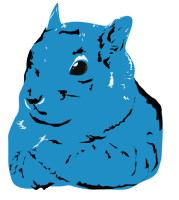

<a name="readme-top"></a>
[![Contributors][contributors-shield]][contributors-url]
[![Forks][forks-shield]][forks-url]
[![Stargazers][stars-shield]][stars-url]
[![Issues][issues-shield]][issues-url]
[![MIT License][license-shield]][license-url]
[![LinkedIn][linkedin-shield]][linkedin-url]

<br />
<div align="center">
  <a href="https://github.com/leyuskckiran1510/peanut-butter">
    
  </a>

  <h1 align="center">peanut-butter</h1>
  <p align="center">
   Simple miniframework for web-backend 
Aim of this project to build a miniframework to get started with the 
web with speed out of the box.
    <br />
    <a href="./docs/readme.md"><strong>Explore the docs »</strong></a>
    <br />
    <br />
    <a href="https://youtu.be/unknown">View Demo</a>
    ·
    <a href="https://github.com/leyuskckiran1510/peanut-butter/issues">Report Bug</a>
    ·
    <a href="https://github.com/leyuskckiran1510/peanut-butter/issues">Request Feature</a>
  </p>
</div>


# Features
1. Static HTML server with costume route [completed]
2. Server static files [2024-Aug-04] [completed]
3. Extended route features
    1. In route  variables [2024-Aug-06] [completed]
    1. Regex route   [2024-Aug-05] [cancled for now]
4. HTML templating   [2024-Aug-06] [started-working] 
    - [2024-Aug-06], template copying works, now just swaping
        the template varibale is left
    - [completed][2024-Aug-07:23-11-33 PM]
5. Redirect, [completed] [2024-Aug-07:23-11-17 PM]
6. urlquery_parse [completed] [2024-Aug-08]
7. A good logo 

# Features To add
1. Middlewares
2. Authentications
3. Persistent datas like Cookies and Sessions,
4. RateLimiting
5. HTTPS/test/support
6. Parse Post forms/urls
 

# Technology and Software in Use
1. [civetweb](https://github.com/civetweb/civetweb)
    1. [Building Civetweb](./lib/README.md)


# Got starting point from 
1. https://medium.com/@justup1080/tutorial-creating-a-minimalist-http-server-in-c-2303d140c725
2. 


# How To use
1. Clone the repo
2. Open `src/main.c` 
3. Write your backend logic, example shown below

```c
#include <string.h>
#include "peanut_butter.h"


void home(Request request){
    const char *method = get_method(request);
    if(!strcmp("GET",method)){
        return render_html(request,"/htmls/index.html");
    }
    return render_html(request,"/htmls/method_not_allowed.html");
}

void about(Request request){
    return render_html(request,"htmls/about.html");
}

void user_home(Request request,UrlVariables urlags){
    TEMP_INIT();
    if(urlags.args[0].value==123){
        UrlQueries quires = parse_query(request);
        for (int i = 0; i < quires.length; ++i){
            TEMP_VAL(quires.queries[i].name,quires.queries[i].value,s);
        }
        render_template(request,"htmls/template.html",TEMP_VAR());
        return  free_url_query(quires);
    }
    if(urlags.args[0].value<123){
        return render_html(request,"htmls/index.html");
    }
    return redirect(request,"/",302);;
}


int server(){
    URL("/",home);
    URL("/about",about);
    VAR_URL("/%d/%d/%s/home",user_home);
    return server_run("8080");
}

int main(void){
    return server();
}
```


4. now compile and run
```bash
make
```
5. And You are good to go.


# FAQ


[contributors-shield]: https://img.shields.io/github/contributors/leyuskckiran1510/peanut-butter.svg?style=for-the-badge
[contributors-url]: https://github.com/leyuskckiran1510/peanut-butter/graphs/contributors
[forks-shield]: https://img.shields.io/github/forks/leyuskckiran1510/peanut-butter.svg?style=for-the-badge
[forks-url]: https://github.com/leyuskckiran1510/peanut-butter/network/members
[stars-shield]: https://img.shields.io/github/stars/leyuskckiran1510/peanut-butter.svg?style=for-the-badge
[stars-url]: https://github.com/leyuskckiran1510/peanut-butter/stargazers
[issues-shield]: https://img.shields.io/github/issues/leyuskckiran1510/peanut-butter.svg?style=for-the-badge
[issues-url]: https://github.com/leyuskckiran1510/peanut-butter/issues
[license-shield]: https://img.shields.io/github/license/leyuskckiran1510/peanut-butter.svg?style=for-the-badge
[license-url]: https://github.com/leyuskckiran1510/peanut-butter/blob/master/LICENSE.txt
[linkedin-shield]: https://img.shields.io/badge/-LinkedIn-black.svg?style=for-the-badge&logo=linkedin&colorB=555
[linkedin-url]: https://linkedin.com/in/leyuskc
[logo]: images/screenshot.png

